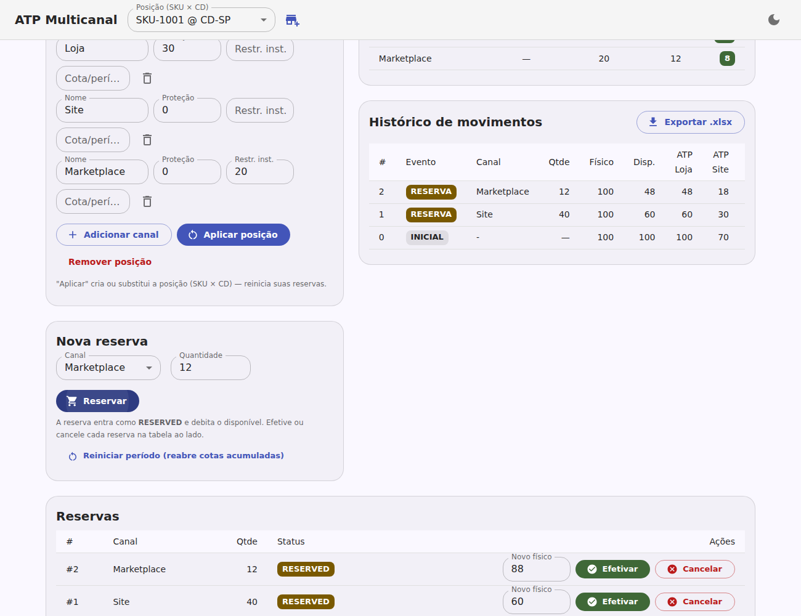
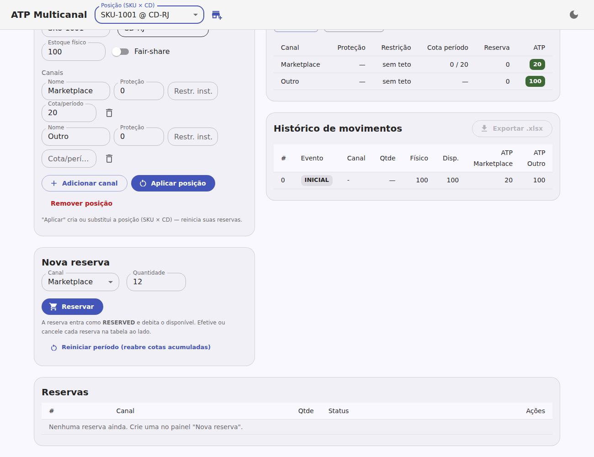
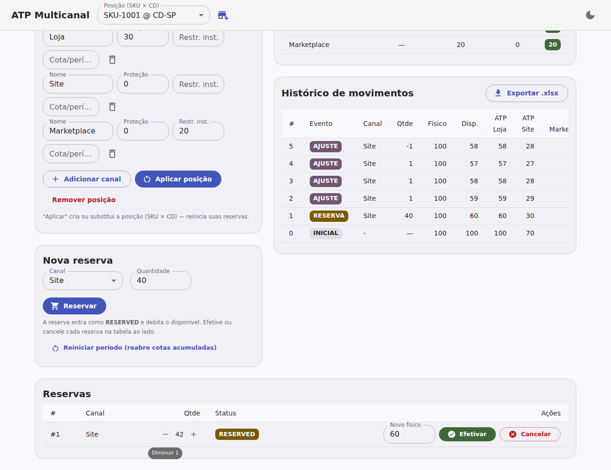
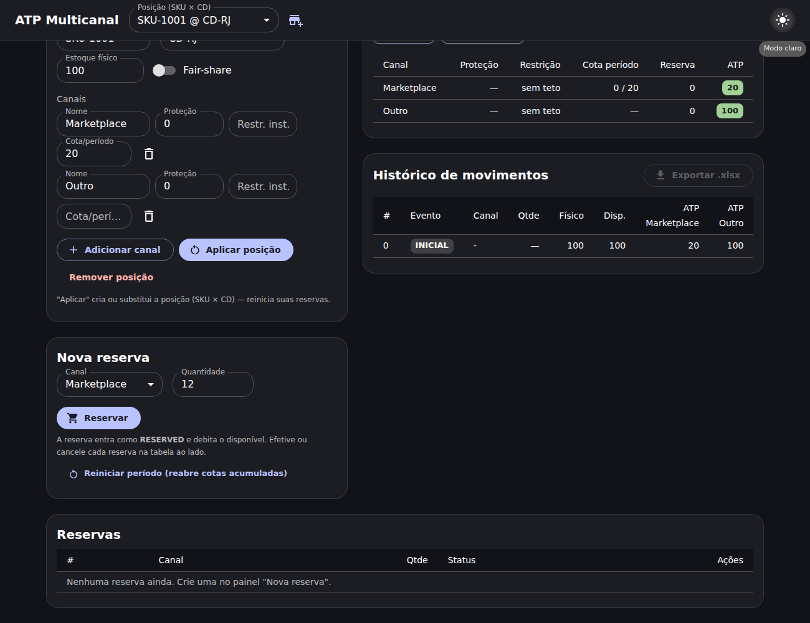

# ATP Multicanal — Estoque de Proteção e Restrição

Simulador e app visual para validar o conceito de **um CD (Centro de
Distribuição) único servindo múltiplos canais de venda** de um SKU, resolvendo
a disputa por estoque via **ATP (Available-to-Promise)** com políticas de
**Estoque de Proteção** e **Estoque de Restrição** por canal.

O repositório contém **um único projeto**: o app web (React + TypeScript +
MUI/Material 3) em [`web/`](web/), com o motor de ATP em
`web/src/atp/engine.ts`.

O estoque é organizado em **posições** identificadas por
**(SKU, Centro de Distribuição)**, cada uma com físico, canais e reservas
próprios. A **chave da reserva** é **SKU + Centro + canal**.

## Telas


*Posição `SKU-1001 @ CD-SP`: seletor de posição na barra, tabela de ATP,
histórico de movimentos e reservas com "Novo físico" + Efetivar/Cancelar.*


*`SKU-1001 @ CD-RJ`: outra posição, com físico, canais, histórico e reservas
próprios — totalmente independente da anterior.*


*Ajuste +/− da quantidade de uma reserva RESERVED (controles "− 42 +"), com os
eventos AJUSTE no histórico e o disponível/ATP recalculados a cada passo.*


*Modo escuro (tema Material 3).*

## Começar

```bash
cd web
npm install
npm run dev     # app (Vite)
npm test        # testes do motor (Vitest)
```

## Documentação

- [`web/README.md`](web/README.md) — visão geral do app, stack e como rodar.
- [`web/docs/ATP.md`](web/docs/ATP.md) — referência conceitual completa: ATP e
  suas variações, proteção/restrição, ciclo de vida da reserva por status
  (RESERVED → EFFECTIVE/CANCELLED), fair-share, invariantes e glossário de
  mercado.

## Em uma linha

Reservas debitam o disponível (status **RESERVED**). Ao **efetivar**
(**EFFECTIVE**), o hold é liberado e o estoque físico é atualizado pela
quantidade vinda de outro sistema (vendas + reposição da indústria).
**Cancelar** (**CANCELLED**) devolve o disponível sem mexer no físico. O motor
garante **não-oversell** e **proteção honrada** a cada operação.
