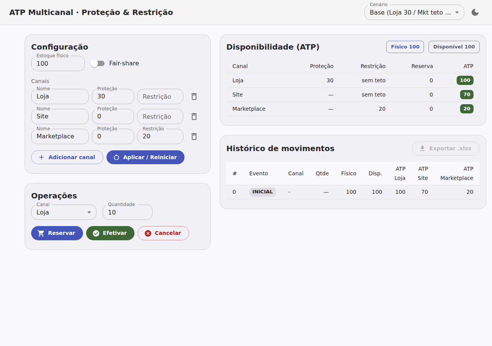

# Simulador de ATP multicanal — Estoque de Proteção e Restrição

> Teste de mesa para validar o conceito de **um CD (Centro de Distribuição)
> único servindo múltiplos canais de venda** de um mesmo SKU, resolvendo a
> disputa por estoque via **ATP (Available-to-Promise)** com políticas de
> **Estoque de Proteção** e **Estoque de Restrição** por canal.

O simulador implementa, em pequena escala e de forma auditável, o modelo de
**allocation planning + ATP consumption** consagrado na literatura de supply
chain (ver [Fundamentação](#2-fundamentação-conceitual) e
[Referências](#12-referências)): reservam-se cotas de estoque por canal e os
pedidos as consomem em tempo real, sem furar promessas nem provocar oversell.

Há **duas frentes**: o **simulador Python** de referência (`estoque_atp/`,
validado por testes e com teste de mesa exportável para `.xlsx`) e um **app
visual React + MUI/Material 3** (`web/`) que porta o mesmo motor para o
navegador — configuração de canais, operações interativas, tabela de ATP ao
vivo e exportação do histórico. Veja [`web/README.md`](web/README.md).



---

## Sumário

1. [Visão geral](#1-visão-geral)
2. [Fundamentação conceitual](#2-fundamentação-conceitual)
   - [2.1 O que é ATP](#21-o-que-é-atp)
   - [2.2 Fórmula canônica](#22-fórmula-canônica-de-atp)
   - [2.3 Variações do ATP](#23-variações-do-atp)
   - [2.4 Allocation planning: proteção e restrição](#24-allocation-planning-proteção-e-restrição)
3. [O modelo deste simulador](#3-o-modelo-deste-simulador)
4. [Controle de concorrência por reserva](#4-controle-de-concorrência-por-reserva)
5. [Invariantes garantidas](#5-invariantes-garantidas)
6. [Estrutura do projeto](#6-estrutura-do-projeto)
7. [Instalação](#7-instalação)
8. [Como rodar](#8-como-rodar)
9. [Exportação do histórico para .xlsx](#9-exportação-do-histórico-para-xlsx)
10. [Uso como biblioteca](#10-uso-como-biblioteca)
11. [Teste de mesa (exemplo completo)](#11-teste-de-mesa-exemplo-completo)
12. [Referências](#12-referências)
13. [Decisões de modelagem e roadmap](#13-decisões-de-modelagem-e-roadmap)

---

## 1. Visão geral

Num arranjo omnichannel, o mesmo SKU num CD alimenta vários canais (loja, site
próprio, marketplaces). Sem uma política de alocação, o canal mais rápido
"come" todo o estoque e os demais rompem. Este projeto modela e valida duas
políticas para resolver isso:

- **Estoque de Proteção** — piso de estoque **reservado a um canal**, blindado
  do consumo dos *demais* para evitar sua ruptura. É **piso, não teto**: o
  canal dono pode ultrapassá-lo se houver disponível; os outros é que não o
  invadem.
- **Estoque de Restrição** — **teto instantâneo** de reservas simultâneas de um
  canal, para favorecer os demais.

A cada pedido, o motor calcula o **ATP do canal** e aceita ou recusa a reserva.
Todo movimento é registrado num histórico exportável para `.xlsx`.

---

## 2. Fundamentação conceitual

### 2.1 O que é ATP

Segundo a definição de referência da **APICS/ASCM** (corpo de conhecimento
padrão da área), ATP é *"a porção não comprometida do estoque de uma empresa e
da produção planejada, mantida no plano-mestre para suportar a promessa de
pedidos a clientes"* — ou seja, o estoque que **não** está reservado para
pedidos existentes e, portanto, está livre para ser prometido a novos pedidos
([APICS OMBOK][apics]; [Logiwa][logiwa]).

O ponto central: **ATP não é o estoque físico**, e sim o estoque *livre para
prometer*. Vender é "prometer entregar"; o ATP responde, a cada pedido: *"posso
aceitar esta venda sem furar nenhuma promessa anterior nem nenhuma política de
canal?"*.

**Os quatro estoques que não se confundem:**

| Conceito | Definição | Neste modelo |
|---|---|---|
| **On-hand (Físico)** | O que está fisicamente no CD | `fisico` |
| **Reservado (Allocated)** | Retido por pedidos em aberto, ainda não faturados | `reservas[canal]` |
| **Disponível (ATS)** | Físico − Reservado − Bloqueado (avaria, quarentena) | `disponivel` |
| **ATP** | Disponível − compromissos e políticas, por canal/janela | `atp(canal)` |

> ⚠️ **ATP ≠ Estoque de Segurança (safety stock).** *Safety stock* protege
> contra **variabilidade** de demanda/lead time (buffer estatístico, agnóstico
> de canal). O **Estoque de Proteção** deste modelo protege um **canal
> específico** da competição interna — é política de alocação, não buffer de
> incerteza ([ShipBob][shipbob]).

### 2.2 Fórmula canônica de ATP

A forma cumulativa mais difundida ([QuickBooks/Intuit][intuit];
[Logiwa][logiwa]):

```
ATP = (Estoque em mãos + Recebimentos programados) − Demanda comprometida
```

- **Recebimentos programados** (ordens de compra, produção, transferências)
  *aumentam* o ATP no período em que chegam.
- **Demanda comprometida** (pedidos confirmados, safety stock, previsão
  reservada) *reduz* o ATP.

### 2.3 Variações do ATP

A literatura classifica o ATP em famílias ([ResearchGate — ATP Systems:
Classification and Framework][rgclass]; [ArcherPoint][archer]):

| Variação | Horizonte | Precisa de calendário de supply? | Caso típico |
|---|---|---|---|
| **ATP discreto / instantâneo** | Agora (snapshot do estoque) | Não | E-commerce em tempo real |
| **ATP cumulativo / time-phased** | Futuro (projeta período a período) | Sim (recebimentos) | Distribuição, B2B com prazo |
| **CTP — Capable-to-Promise** | Futuro + capacidade fabril | Sim (+ capacidade) | Make-to-order |
| **PTP — Profitable-to-Promise** | Futuro + margem/custo | Sim (+ dados financeiros) | Priorização por rentabilidade |

- **Discreto vs. cumulativo:** o discreto olha só o disponível de agora; o
  cumulativo soma recebimentos futuros e subtrai a demanda já comprometida,
  período a período, respondendo *"consigo entregar no dia X?"*.
- **CTP** estende o ATP para quando não há estoque mas **há capacidade de
  produzir/comprar a tempo** ([ArcherPoint][archer]).
- **PTP** é a evolução que pondera **rentabilidade** — promessa viável *e*
  financeiramente vantajosa ([Cargoz][cargoz]).

> **Este simulador usa ATP discreto/instantâneo.** As demais variações estão no
> [roadmap](#13-decisões-de-modelagem-e-roadmap).

### 2.4 Allocation planning: proteção e restrição

Quando **vários canais** disputam o mesmo estoque, sistemas de planejamento
avançado (APS) adotam uma abordagem em **dois passos** ([Meyr, *Customer
segmentation, allocation planning and order promising in make-to-stock
production*, OR Spectrum][meyr]; [Kilger & Meyr, em *Supply Chain Management
and Advanced Planning*][scmap]):

1. **Allocation planning** — aloca cotas de ATP a segmentos/canais *antes* dos
   pedidos, conforme demanda esperada e prioridade.
2. **ATP consumption** — os pedidos que chegam consomem essas cotas em tempo
   real, respeitando os limites.

**É exatamente o que este projeto modela:**

| Conceito do projeto | Equivalente na literatura/mercado |
|---|---|
| **Estoque de Proteção** | Cota alocada / *inventory fencing* / *reserved / ring-fenced inventory* |
| **Estoque de Restrição** | Teto de consumo / *allocation cap / quota* / *throttling* |
| **Reserva → Efetivação** | *ATP consumption* (soft → hard allocation) |

Proteção e restrição são, muitas vezes, **as duas faces da mesma moeda**:
reservar X para o canal A é, na prática, restringir esse X dos demais. O "ATP
avançado" evolui em três eixos — **visibilidade de supply, diferenciação de
demanda e flexibilidade de decisão** ([Kilger & Meyr][scmap]); este simulador
foca na **diferenciação de demanda por canal**.

**Variações de cada política** (o que este modelo adota está em **negrito**):

- **Proteção:** *hard* (intocável) · **soft para o dono / hard para os
  demais** · com janela temporal (expira) · **residual** (ver §3).
- **Restrição:** **instantânea** (limita reservas simultâneas) · acumulada por
  período (cota de vendas).
- **Sobre-comprometimento** (Σ proteções > físico): **rejeitar na construção**
  (padrão — `ConfiguracaoInvalida`) ou **fair-share** (rateio proporcional pelo
  método do maior resto) habilitando `fair_share=True`.

---

## 3. O modelo deste simulador

Para o canal `c`:

```
Disponível            = Físico − Σ Reservas_de_todos_os_canais

proteção_residual(k)  = max(0, Proteção(k) − Reservas(k))

ATP(c) = max(0, min(
             Disponível − Σ_{k≠c} proteção_residual(k),   # sobra após blindar os outros
             Restrição(c) − Reservas(c)                    # teto instantâneo do próprio canal
         ))
```

**Por que proteção *residual* e não a proteção cheia?** A parte da proteção que
o próprio dono já reservou **já saiu do `Disponível`**. Subtraí-la de novo do
ATP dos outros blindaria o mesmo estoque **em dobro**, desperdiçando
disponibilidade. O residual (`Proteção − Reservas` do dono) é exatamente o que
ainda precisa ficar guardado.

> **Exemplo do bloqueio em dobro.** Loja protege 30 e já reservou 25 (residual
> = 5), físico = 100.
> - Com residual: Site vê `100 − 25 − 5 = 70`. ✅
> - Sem residual (errado): Site veria `100 − 25 − 30 = 45` — 5 unidades presas
>   à toa.

O `max(0, …)` garante ATP nunca negativo (relevante sob proteções
sobre-comprometidas).

📖 Aprofundamento completo em [`docs/ATP.md`](docs/ATP.md).

---

## 4. Controle de concorrência por reserva

```
[disponível] ──reservar──► [reservado] ──efetivar──► [venda confirmada]
      ▲                          │                          │
      │                          └──cancelar──┘             │
      └──────── físico baixado (mesma operação) ────────────┘
```

- **Reservar** — retém estoque, reduzindo o disponível. Resolve a concorrência:
  dois pedidos não reservam a mesma unidade (evita *oversell*).
- **Efetivar** — confirma a venda: a reserva é **liberada** (volta ao
  disponível) **e**, na mesma operação, o **físico é baixado**. Efeito líquido
  no disponível = **zero**.
- **Cancelar** — devolve a reserva ao disponível sem tocar no físico.

> **O gap de efetivação (único risco real).** Se liberar a reserva e baixar o
> físico não forem **atômicos**, abre-se uma janela em que a reserva já saiu
> mas o físico ainda não baixou → disponível "fantasma" → oversell. Aqui,
> `efetivar()` faz as duas coisas na **mesma operação**, fechando o gap por
> construção.

---

## 5. Invariantes garantidas

O motor valida, **após cada operação** (violação levanta
`ViolacaoDeInvariante` — sinaliza bug do modelo, não erro de uso):

1. **Não-oversell** — a soma das reservas nunca excede o físico
   (`Disponível ≥ 0`). Nenhuma unidade é prometida duas vezes.
2. **Proteção honrada** — todo canal protegido sempre alcança sua proteção
   (limitada pelo físico): `Reservas(k) + ATP(k) ≥ min(Proteção(k), Físico)`.

**Critério de sucesso do teste de mesa:** sob qualquer sequência concorrente de
reservas/efetivações/cancelamentos, nenhuma venda confirmada excede o físico
**e** nenhum canal protegido rompe enquanto houver estoque protegido não
consumido para ele.

---

## 6. Estrutura do projeto

```
estoque_atp/
  motor.py           Motor de ATP (Canal, MotorATP) + histórico de movimentos
  planilha.py        Exportação do histórico para .xlsx (openpyxl)
cenarios/
  _apresentacao.py   Helpers de impressão da tabela de ATP e exportação
  cenario_base.py    Teste de mesa base (3 canais, passo a passo)
  variacoes.py       7 variações, cada uma isolando um comportamento do modelo
tests/
  test_motor.py      Fórmulas, ciclo de reserva e invariantes
  test_historico.py  Histórico em memória e exportação .xlsx
  test_cenarios.py   Fumaça de todos os cenários
docs/
  ATP.md             Documentação de referência do modelo e variações
web/                 App visual React + MUI/Material 3 (motor portado p/ TS)
  src/atp/engine.ts  Port TypeScript do motor (paridade validada por testes)
  src/components/     ConfigPanel, AtpTable, OperationsPanel, HistoryTable
pyproject.toml       Metadados e dependências (openpyxl)
```

---

## 7. Instalação

Requer **Python ≥ 3.10**.

```bash
# Instala o pacote e a dependência de planilha (openpyxl)
pip install -e .

# (opcional) para rodar os testes
pip install pytest
```

---

## 8. Como rodar

```bash
# Cenário base: imprime a tabela de ATP a cada evento e
# exporta o histórico para saida/cenario_base.xlsx
python -m cenarios.cenario_base

# Todas as variações (base + 7 cenários), cada uma exporta seu .xlsx em saida/
python -m cenarios.variacoes

# Suíte de testes
pytest
```

**Variações do teste de mesa** (`python -m cenarios.variacoes`), cada uma
isolando um comportamento do modelo:

| # | Cenário | O que demonstra |
|---|---|---|
| base | proteção + restrição | fluxo completo T0→T4 do exemplo da §11 |
| 1 | **cancelamento** | cancelar devolve ao disponível sem mexer no físico; efetivar baixa o físico |
| 2 | **disputa pela última unidade** | não-oversell: só um canal leva a última unidade; reserva excedente é recusada |
| 3 | **por que proteger** | contraste com vs. sem proteção — sem ela o canal secundário rompe |
| 4 | **proteção residual** | o residual evita bloquear estoque em dobro (Site vê 70, não 45) |
| 5 | **restrição instantânea** | o teto reabre ao efetivar/cancelar |
| 6 | **saturação no limite** | duas proteções somando exatamente o físico |
| 7 | **config inválida** | proteções sobre-comprometidas são recusadas na construção |
| 8 | **fair-share** | sobre-comprometido rateado proporcionalmente (`fair_share=True`) |

---

## 9. Exportação do histórico para .xlsx

Cada operação registra um **Movimento** com o estado logo após o evento. A
planilha gerada tem duas abas:

- **Movimentos** — uma linha por evento (`INICIAL`, `RESERVA`, `EFETIVACAO`,
  `CANCELAMENTO`), com físico, disponível, reservas por canal e ATP por canal;
  a célula de evento é colorida por tipo.
- **Configuração** — estoque físico inicial e as políticas
  (proteção/restrição) de cada canal.

```python
from estoque_atp import exportar_xlsx
exportar_xlsx(motor, "saida/historico.xlsx")
```

> `saida/` e arquivos `*.xlsx` ficam fora do versionamento (`.gitignore`) por
> serem gerados.

---

## 10. Uso como biblioteca

```python
from estoque_atp import Canal, MotorATP, exportar_xlsx

motor = MotorATP(
    fisico=100,
    canais=[
        Canal("Loja", protecao=30),         # 30 garantidas para a Loja
        Canal("Site"),                      # livre
        Canal("Marketplace", restricao=20), # teto de 20 simultâneas
    ],
)

motor.atp("Site")                    # 70  (100 − 30 de proteção da Loja)
motor.reservar("Site", 40)           # reserva 40 para o Site
motor.efetivar("Site", 40)           # confirma venda: libera reserva e baixa físico
motor.snapshot()                     # {"Loja": ..., "Site": ..., "Marketplace": ...}

exportar_xlsx(motor, "saida/historico.xlsx")
```

Erros de uso levantam exceções específicas: `ErroDeReserva` (reserva acima do
ATP) e `ErroDeEfetivacao` (efetivar/cancelar acima da reserva ativa).

---

## 11. Teste de mesa (exemplo completo)

Físico = 100. **Loja** protege 30 · **Site** livre · **Marketplace** restringe 20.

| Evento | Ação | Físico | Disp. | ATP Loja | ATP Site | ATP Mkt |
|---|---|---:|---:|---:|---:|---:|
| **T0** | inicial | 100 | 100 | 100 | 70 | 20 |
| **T1** | Mkt reserva 15 | 100 | 85 | 85 | 55 | 5 |
| **T2** | Site reserva 40 | 100 | 45 | 45 | 15 | 5 |
| **T3** | Mkt efetiva 15 | 85 | 45 | 45 | 15 | 15 |
| **T4** | Loja reserva 30 | 85 | 15 | 15 | 15 | 15 |

- **T1:** teto 20 do Marketplace − 15 reservadas → ATP 5.
- **T2:** mesmo com 55 reservadas, a **proteção da Loja segue intocada**
  (`Disponível − 30`); Site e Mkt nunca a tocam.
- **T3:** ao efetivar, o físico baixa (100→85), o disponível **não muda** e o
  teto do Marketplace **reabre** (0→15).
- **T4:** a Loja consome exatamente sua proteção; nenhuma invariante quebra.

---

## 12. Referências

Fontes usadas na fundamentação conceitual:

- **APICS/ASCM OMBOK** — definição-padrão de ATP no corpo de conhecimento de
  operações. <https://www.apics.org/apics-for-individuals/apics-magazine-home/resources/ombok/apics-ombok-framework-table-of-contents/apics-ombok-framework-5.5>
- **Logiwa** — *Understanding Available to Promise (ATP) in Supply Chain
  Management*. <https://www.logiwa.com/blog/what-is-available-to-promise>
- **ShipBob** — *Available-to-Promise (ATP) Inventory Guide* (ATP vs. estoque
  reservado e safety stock). <https://www.shipbob.com/blog/available-to-promise/>
- **QuickBooks/Intuit** — *Available to Promise: Examples & Formula*.
  <https://quickbooks.intuit.com/r/midsize-business/available-to-promise-inventory-calculations-for-supply-chains/>
- **ArcherPoint** — *Available to Promise vs. Capable to Promise*.
  <https://archerpoint.com/available-to-promise-vs-capable-to-promise/>
- **Cargoz** — *Profitable to Promise (PTP)*.
  <https://www.cargoz.com/glossary/profitable-to-promise-1589>
- **Fleischmann & Meyr / ResearchGate** — *Available-To-Promise (ATP) Systems:
  Classification and Framework for Analysis*.
  <https://www.researchgate.net/publication/245331293_Available-To-Promise_ATP_Systems_Classification_and_Framework_for_Analysis>
- **Meyr, H.** — *Customer segmentation, allocation planning and order promising
  in make-to-stock production*, OR Spectrum.
  <https://link.springer.com/article/10.1007/s00291-008-0123-x>
- **Kilger & Meyr** — *Demand Fulfilment and ATP*, em *Supply Chain Management
  and Advanced Planning* (Stadtler et al.).
  <https://link.springer.com/chapter/10.1007/978-3-540-93775-3_5>

---

## 13. Decisões de modelagem e roadmap

**Decisões já cravadas:**

- **Restrição = instantânea** (limita reservas simultâneas; o teto reabre ao
  efetivar/cancelar). Não é cota acumulada por período.
- **Proteção = soft para o dono** (piso garantido, mas ele pode ultrapassar) e
  **hard para os demais** (nunca invadem o piso alheio), via **proteção
  residual**.
- **Efetivação = atômica** (libera reserva e baixa físico juntos), fechando a
  janela de oversell.
- **ATP = discreto/instantâneo.**
- **Sobre-comprometimento = fair-share opcional** (rateio proporcional pelo
  maior resto) ou recusa na construção.
- **Interface visual** = app React + MUI/Material 3 em `web/`, com o motor
  portado para TypeScript e paridade validada por testes.

**Próximos passos (cada um isolando uma variação):**

- **Prioridade entre canais** no rateio sob escassez (o fair-share atual é
  proporcional; uma variante seria por prioridade/segmento).
- **Proteção com janela temporal** (expira e libera aos demais após um horário).
- **Restrição acumulada por período** (cota de vendas) como política alternativa.
- **ATP time-phased** com recebimentos futuros do CD.
- **Multi-CD** (mesmo SKU em vários CDs, com regra de sourcing por canal).

[apics]: https://www.apics.org/apics-for-individuals/apics-magazine-home/resources/ombok/apics-ombok-framework-table-of-contents/apics-ombok-framework-5.5
[logiwa]: https://www.logiwa.com/blog/what-is-available-to-promise
[shipbob]: https://www.shipbob.com/blog/available-to-promise/
[intuit]: https://quickbooks.intuit.com/r/midsize-business/available-to-promise-inventory-calculations-for-supply-chains/
[archer]: https://archerpoint.com/available-to-promise-vs-capable-to-promise/
[cargoz]: https://www.cargoz.com/glossary/profitable-to-promise-1589
[rgclass]: https://www.researchgate.net/publication/245331293_Available-To-Promise_ATP_Systems_Classification_and_Framework_for_Analysis
[meyr]: https://link.springer.com/article/10.1007/s00291-008-0123-x
[scmap]: https://link.springer.com/chapter/10.1007/978-3-540-93775-3_5
