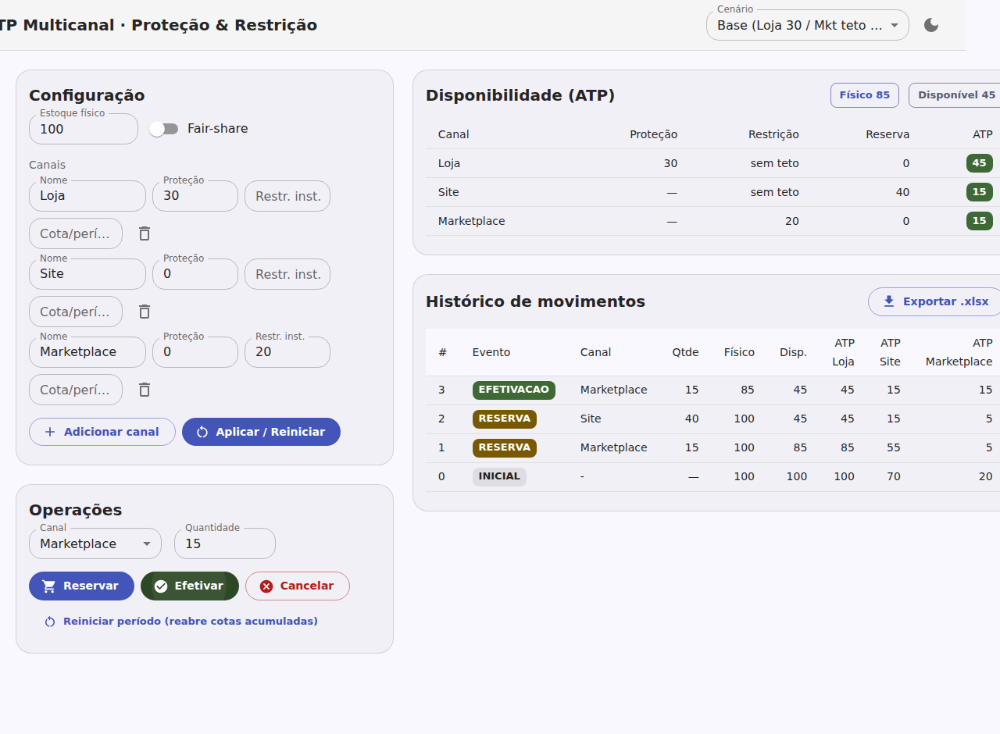
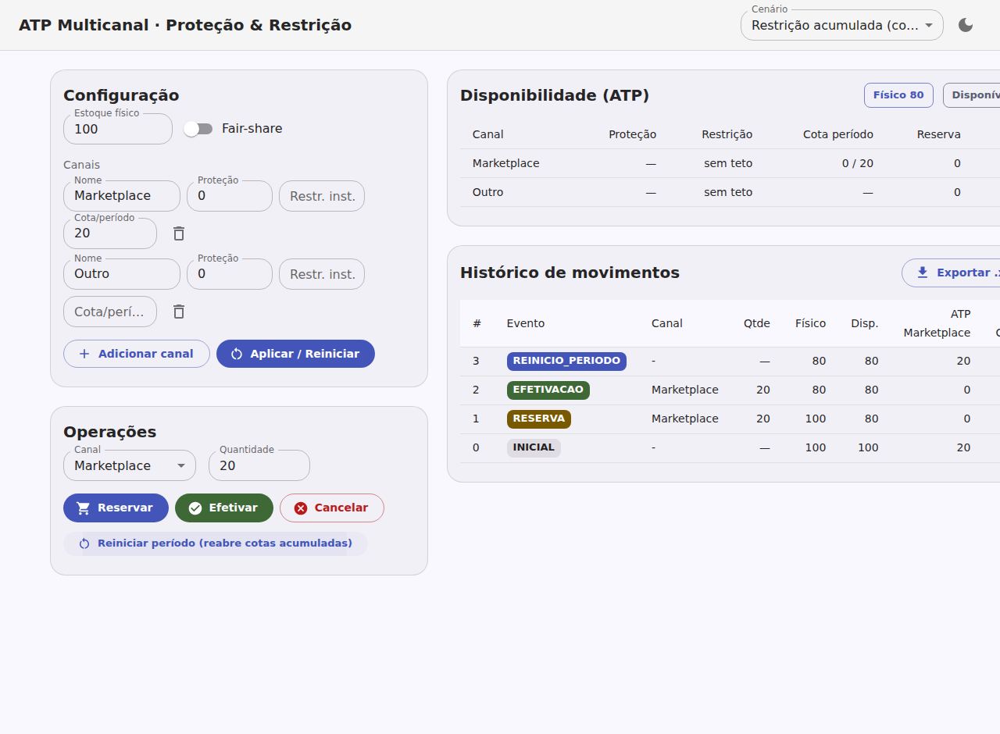
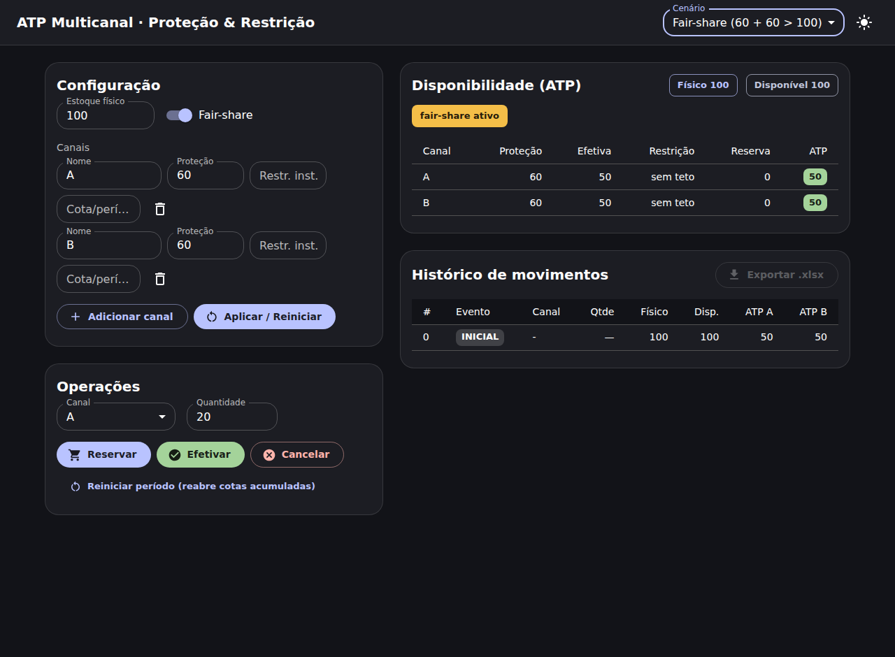

# ATP Multicanal — app visual (React + MUI / Material 3)

Interface visual do simulador de **ATP multicanal com Estoque de Proteção e
Restrição**. O motor de ATP foi portado de Python (`estoque_atp/`) para
TypeScript (`src/atp/engine.ts`), com **paridade validada por testes** — os
mesmos números do teste de mesa.

## Stack

- **React 18** + **TypeScript** + **Vite**
- **MUI (Material UI) 6** com tema **inspirado no Material 3** (paleta tonal,
  cantos arredondados, modo claro/escuro)
- **write-excel-file** (write-only, mantida e sem advisories conhecidos) para
  exportar o histórico de movimentos em `.xlsx`

## Funcionalidades

- Configurar **físico**, **canais** (nome, proteção, restrição instantânea e
  cota acumulada por período) e **fair-share**.
- Operar **Reservar / Efetivar / Cancelar** por canal e **Reiniciar período**
  (reabre as cotas acumuladas); erros (ATP excedido, etc.) em *snackbar*.
- Tabela de **Disponibilidade (ATP)** ao vivo — mostra proteção, proteção
  **efetiva** (quando o fair-share está ativo), restrição, **cota do período**
  (vendas/cota, quando há restrição acumulada), reserva e ATP.
- **Histórico de movimentos** com eventos coloridos e **exportação `.xlsx`**
  (abas Movimentos + Configuração, com a célula de evento colorida por tipo,
  igual ao Python).
- **Cenários prontos** (base, por que proteger, saturação no limite,
  fair-share) no seletor do topo.

## Como rodar

```bash
cd web
npm install
npm run dev       # servidor de desenvolvimento (Vite)
npm run build     # build de produção em dist/
npm test          # testes do motor portado (Vitest) — paridade com o Python
```

## Telas


*Cenário base: ATP Loja 100 / Site 70 / Marketplace 20.*


*Após reservar e efetivar: histórico colorido e ATP recalculado ao vivo.*


*Restrição acumulada: coluna "Cota período" (0/20 após reinício) e o evento
REINICIO_PERIODO no histórico.*


*Fair-share: proteções 60 + 60 rateadas em 50 + 50 (coluna "Efetiva").*

## Relação com o simulador Python

`src/atp/engine.ts` é um port fiel de `estoque_atp/motor.py`. A suíte
`src/atp/engine.test.ts` reproduz os cenários-chave (base T0→T4, proteção
residual, não-oversell, config inválida, fair-share) garantindo que a UI e o
simulador de referência dão os mesmos resultados.

> Nota: a exportação usa `write-excel-file` (write-only, mantida, sem
> advisories conhecidos) em vez do SheetJS/`xlsx`, cujo pacote npm está
> abandonado e carrega advisories de leitura. As vulnerabilidades restantes no
> `npm audit` são do `esbuild` (dependência transitiva do Vite) e afetam apenas
> o *dev server*, não o build de produção.
