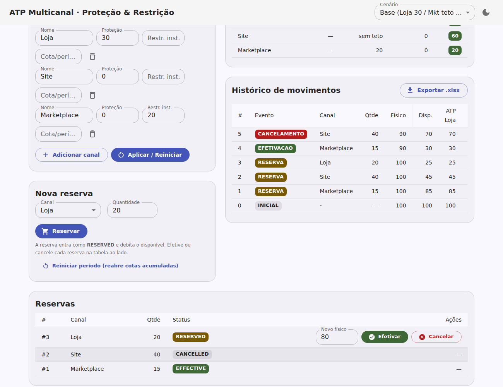
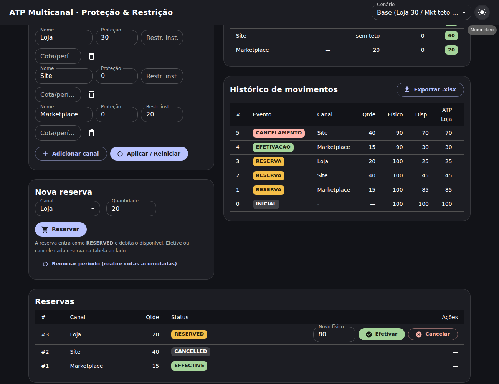

# ATP Multicanal — Estoque de Proteção e Restrição

App visual (e motor) para validar o conceito de **um CD (Centro de
Distribuição) único servindo múltiplos canais de venda** de um SKU, resolvendo
a disputa por estoque via **ATP (Available-to-Promise)** com políticas de
**Estoque de Proteção** e **Estoque de Restrição** por canal.

Este é o **único projeto do repositório**. Toda a lógica de ATP vive no motor
TypeScript `src/atp/engine.ts`, com suíte de testes em `src/atp/engine.test.ts`.
A referência conceitual completa está em [`docs/ATP.md`](docs/ATP.md).

## Stack

- **React 18** + **TypeScript** + **Vite**
- **MUI (Material UI) 6** com tema **inspirado no Material 3** (paleta tonal,
  cantos arredondados, modo claro/escuro)
- **write-excel-file** (write-only, mantida e sem advisories conhecidos) para
  exportar o histórico de movimentos em `.xlsx`

## Ciclo de vida da reserva (status)

A concorrência é resolvida por **reserva**, com ciclo de vida por status:

| Status | Efeito |
|---|---|
| **RESERVED** | Garante a intenção de compra e **debita o saldo disponível** (`disponível = físico − Σ RESERVED`). |
| **EFFECTIVE** | Venda confirmada. **Recompõe o saldo** (libera o hold) e, no mesmo momento, o **físico é atualizado pela quantidade vinda de outro sistema** (vendas realizadas + reposição da indústria). |
| **CANCELLED** | Intenção desfeita. Recompõe o saldo; o físico não muda. |

O ponto central: a efetivação **não** debita o físico por conta própria — ela
libera o hold e aplica o **físico autoritativo do sistema externo** (o campo
"Novo físico" na tabela de reservas; se omitido, assume `físico − quantidade`).

## Funcionalidades

- Configurar **físico**, **canais** (nome, proteção, restrição instantânea e
  cota acumulada por período) e **fair-share**.
- **Nova reserva** por canal (entra como RESERVED, debita o disponível).
- **Tabela de Reservas**: cada reserva com seu status; nas RESERVED, informar o
  **Novo físico** (feed externo) e **Efetivar**, ou **Cancelar**.
- **Reiniciar período** (reabre as cotas de restrição acumulada).
- Tabela de **Disponibilidade (ATP)** ao vivo — proteção, proteção **efetiva**
  (com fair-share), restrição, **cota do período** (vendas/cota), reservado e ATP.
- **Histórico de movimentos** com eventos coloridos e **exportação `.xlsx`**
  (abas Movimentos + Configuração, célula de evento colorida por tipo).
- **Cenários prontos** no seletor do topo; erros (ATP excedido, oversell) em
  *snackbar*.

## Como rodar

```bash
npm install
npm run dev       # servidor de desenvolvimento (Vite)
npm run build     # build de produção em dist/
npm test          # testes do motor (Vitest)
```

## Telas


*Reservas com status RESERVED / EFFECTIVE / CANCELLED. Ao efetivar a #1, o
físico foi atualizado para 90 pelo feed externo.*


*Mesma tela em modo escuro (tema Material 3).*

## Modelo de ATP

Para o canal `c`:

```
Disponível           = Físico − Σ Reservas RESERVED
proteçãoResidual(k)  = max(0, proteçãoEfetiva(k) − reservadoRESERVED(k))
ATP(c) = max(0, min(
           Disponível − Σ_{k≠c} proteçãoResidual(k),
           Restrição(c) − reservadoRESERVED(c),
           RestriçãoAcumulada(c) − vendasPeríodo(c) − reservadoRESERVED(c)
         ))
```

Invariantes checadas a cada operação: **não-oversell** (`Σ RESERVED ≤ físico`) e
**proteção honrada**. Configurações contraditórias (proteções que somam mais
que o físico sem fair-share; restrição de um canal menor que sua proteção) são
recusadas na construção com `ConfiguracaoInvalida`.

> Nota: a exportação usa `write-excel-file` (write-only, mantida, sem
> advisories conhecidos). As vulnerabilidades restantes no `npm audit` são do
> `esbuild` (dependência transitiva do Vite) e afetam apenas o *dev server*,
> não o build de produção.
